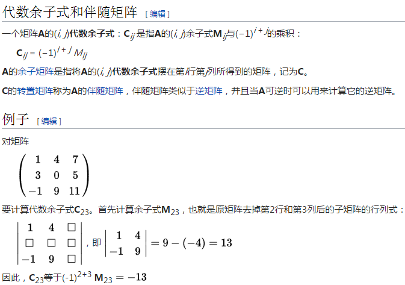
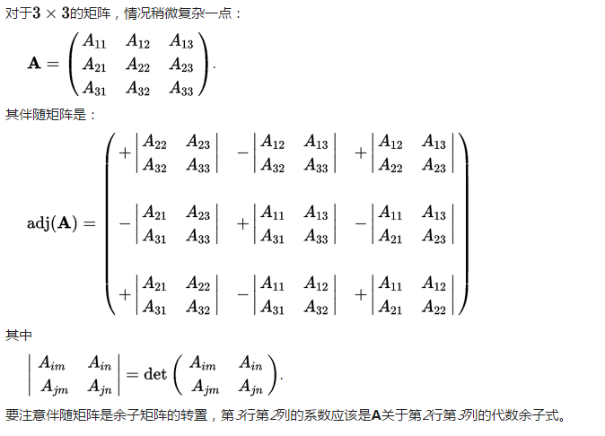
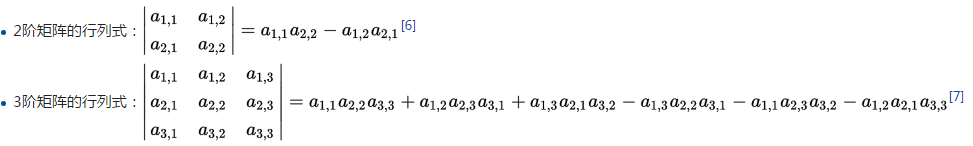

## 1.Basic concepts
- 1.矩阵相加必须有相同维数;遵循加法交换法则
- 2.矩阵相乘,行列相乘并相加;**不遵循乘法交换法则**
- 3.矩阵相乘得到的乘积的维数为第一个矩阵的行，第二个矩阵的列
    - 2\*3的矩阵与3\*2的矩阵的乘积维数为2\*2
- 4.矩阵能够相乘的前提是:第一个矩阵的列数必须和第二个矩阵的行数相等
- 5.矩阵的逆(inverse)
    - 单位矩阵`I`:左上到右下对角线为1,其余元素均为0的n\*n维矩阵
    - 行列式(determinant)`|A|`:左上右下对角线相乘与右上左下对角线乘积的差
        - 以[a,b;c,d]矩阵为例;`|A|=ad-bc`
    - 矩阵的逆:矩阵和矩阵的逆相乘，得到单位矩阵`I`;这个两个矩阵也互逆
        - 算法:`A^(-1)=(1/|A|)*[d,-b;-c,a]`:其中[d,-b;-c,a]为原矩阵的斜下对角线元素调换；斜上对角线元素取其相反数
    - 三维矩阵的逆的算法
        - 矩阵的余子式(Matrix of minors)
        - 矩阵的代数余子式(Matrix of cofactors)
            - 矩阵的余子式按照[+,-,+;-,+,-;+,-,+]方式取正或取反后得到矩阵的代数余子式
            - 
        - 伴随矩阵(Adjugate of matrix)
            - `adj(A)`:将矩阵的代数余子式通过斜下对角线进行翻转得到其原矩阵的伴随矩阵
            - 
        - 三维矩阵的行列式`|A|`:矩阵的第一行与其代数余子式`adj(A)`的第一行元素分别相乘后的和(等同以下算法)
            - 
        - 三维矩阵逆的算法:`A^(-1)=(1/|A|)*adj(A)`
        - [高斯消元法求矩阵的逆](https://zh.wikipedia.org/wiki/高斯消去法)
- 6.矩阵法求解方程组
    - `x = A^(-1)\*b`