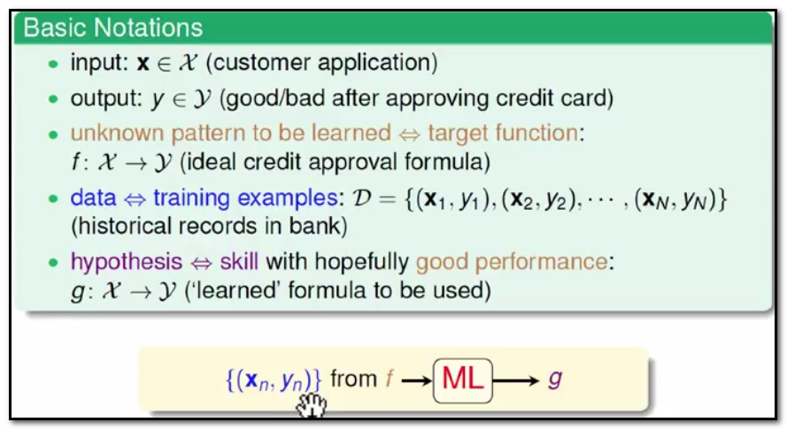
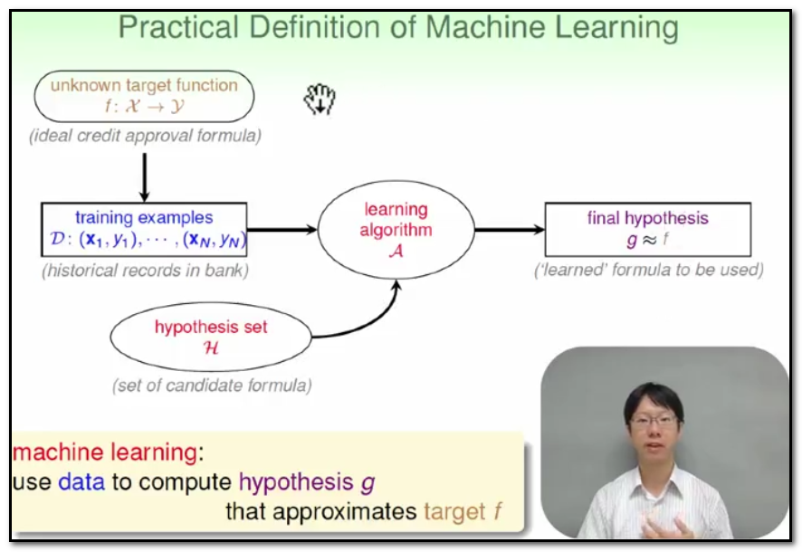
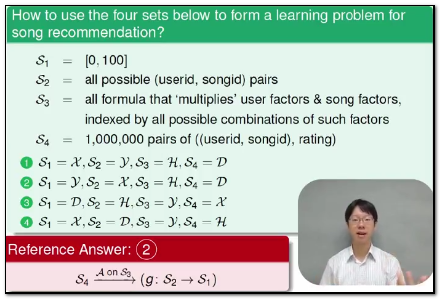
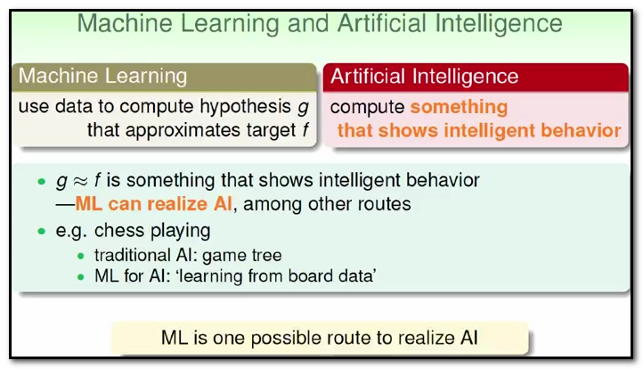
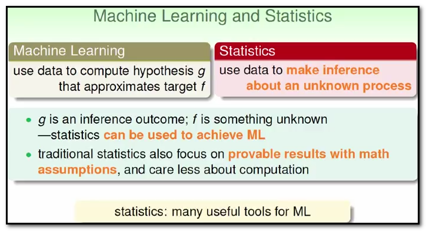
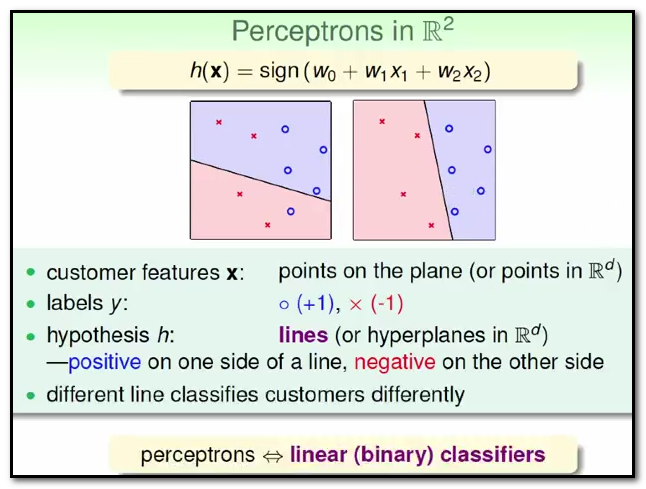
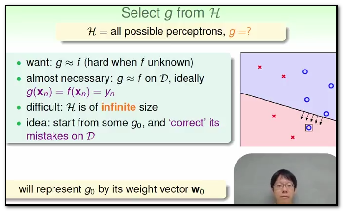
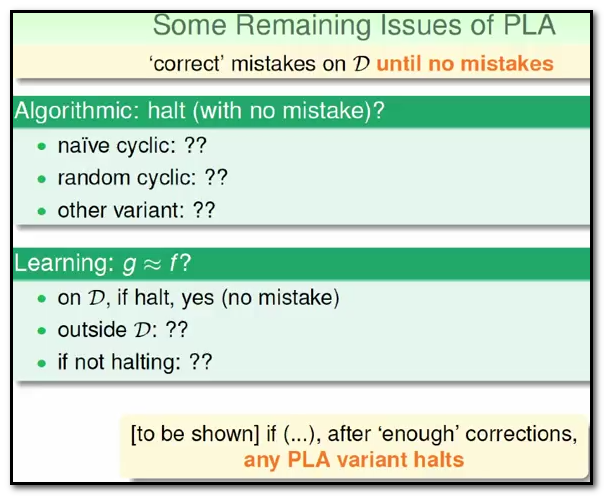

## 1.Course Introduction
- Foundation oriented and story-like

## 2.What is Machine Learning
- Use data to approximate target

## 3.Applications of Machine Learning
- Almost everywhere

## 4.Components of Machine Learing
- 1.Basic Notatations
   - 
   - 
   - 
   - X:输入
   - Y:输出
   - D:数据
   - H:假说集
   - g:假说
   - f:理想关系
   - 机器学习:从资料`D`出发，机器学习演算法`A`需要算出一个假说`hypothesis:g`,最终目的是希望这个`g`能够最接近理想的`f`.
   - **Summary:`A` takes `D` and `H` to get `g`**
   

## 5.Machine Learning and Other Fields
- Data Mining
- 
- Artificial Intelligence
- 
- Statistics
- 

## 6.Perceptron
- 1.A simple Hypothesis Set: the 'Perceptron'
- 
- 2.Vector Form of Perceptron Hypothesis
- 
- 3.Linear classifiers
- 

## 7.Perceptron Learing Algorithm(PLA)
- 1.Select g from H 
- 
- 2.PLA
- 
- 3.Some remaining issues of PLA
- 